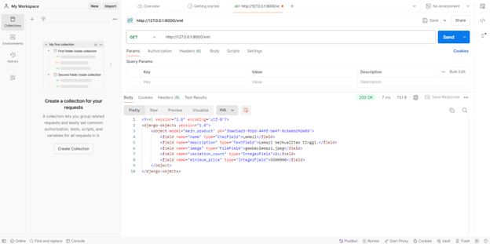
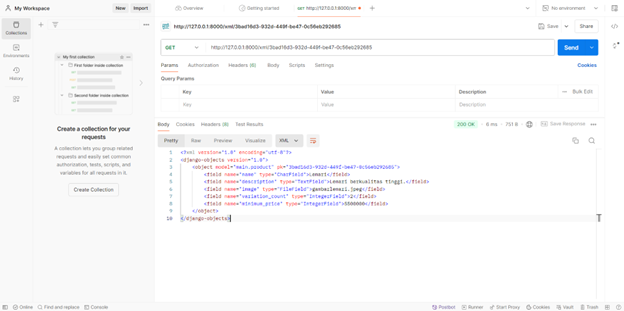
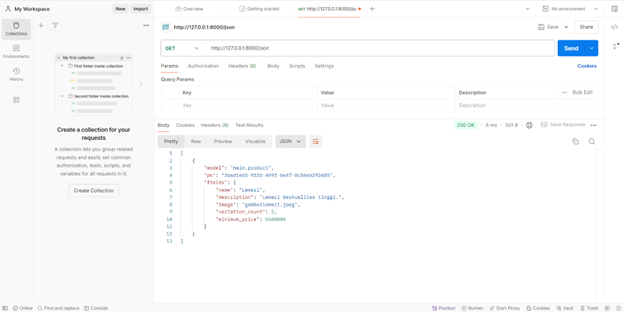
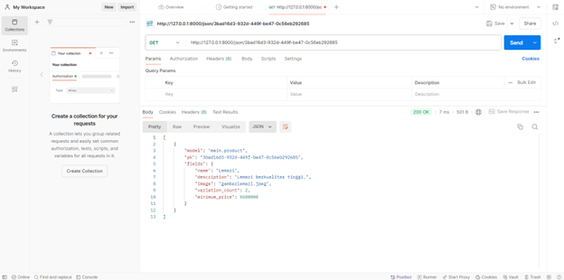

- Nama: Nabil Zahid Rahman
- NPM: 2306203324
- Kelas: PBP-A

# Tugas 3 Checkpoint

### Langkah-langkah dalam mengimplementasikan checklist pada tugas:
1. Membuat sebuah class ProductForm yang terdiri atas 5 atribut, yakni karakter dari setiap objek produk yang akan dibuat (mencakup nama, deskripsi, gambar dari produk, variasi produk, dan harga produk yang menampilkan harga terendah dari variasi yang ada).
2. Mendefinisikan fungsi ```show_xml```, ```show_json```, ```show_xml_by_id```, ```show_json_by_id```, yakni fungsi yang akan memuat informasi dari setiap objek ```Product``` dalam susunan yang lebih easy-access dan versatile.
3. Menambahkan path-path dari fungsi pada nomor (2) untuk dapat diakses dari server yang dijalankan.

### 1. Mengapa kita memerlukan data delivery dalam sebuah platform?
Dalam pengembangan platform, kita perlu mengirim data (seperti HTML, XML, atau JSON) antara berbagai bagian sistem agar platform tersebut menjadi responsif dan dapat menyesuaikan interaksi pengguna. Hal Ini penting untuk memisahkan logika bisnis (seperti yang ada di views.py) dari tampilan yang biasanya berada pada direktori templates. Dengan dilakukannya pengiriman data, halaman web dapat diperbarui secara otomatis sesuai perubahan data tanpa perlu mengubah struktur HTML secara manual. Oleh karena itu, data delivery menjadi penting agar front-end dan back-end dapat terintegrasi dengan baik.

### 2. Mana yang lebih baik antara XML dan JSON? Mengapa JSON lebih populer dari XML?
JSON lebih disukai karena lebih efisien dan mudah dibaca dengan formatnya yang sederhana, menggunakan pasangan "key":"value". JSON juga mendukung struktur data yang kompleks seperti objek, array, dan nilai primitif, sedangkan XML cenderung kurang fleksibel dalam menangani data kompleks. Selain itu, banyak bahasa pemrograman yang mendukung parsing JSON dengan mudah, seperti JavaScript yang memiliki fungsi JSON.parse() dan JSON.stringify() untuk menangani data JSON.

### 3. Apa fungsi dari method is_valid() pada form Django dan mengapa dibutuhkan?
Method is_valid() pada form Django digunakan untuk memvalidasi data yang diisi oleh pengguna. Fungsinya adalah memastikan bahwa data yang dikirimkan sesuai dengan aturan dan tipe data yang telah ditetapkan pada form. Contohnya, jika suatu field harus berisi angka (IntegerField), method ini akan memeriksa apakah input tersebut memang bertipe integer. Jika semua data sesuai, method ini akan mengembalikan nilai True, sebaliknya jika ada kesalahan, nilai yang dikembalikan adalah False. Fungsi ini penting untuk menjaga agar hanya data valid yang disimpan ke database serta mencegah serangan seperti SQL Injection atau XSS.

### 4. Mengapa kita membutuhkan csrf_token pada form di Django dan apa risikonya jika tidak digunakan?
csrf_token adalah mekanisme keamanan yang melindungi aplikasi dari serangan Cross-Site Request Forgery (CSRF). Ini penting saat pengguna mengirimkan form yang memerlukan autentikasi, seperti form login atau form yang memodifikasi data di database. Django menggunakan token unik untuk setiap sesi, dan token ini diverifikasi di server setiap kali form dikirim. Jika token yang diterima tidak sesuai dengan yang disimpan di server, permintaan akan ditolak. Jika kita tidak menambahkan csrf_token, aplikasi akan menjadi rentan terhadap serangan CSRF, di mana penyerang bisa mengirim permintaan palsu atas nama pengguna tanpa sepengetahuan mereka. Ini bisa disalahgunakan oleh penyerang untuk melakukan tindakan yang merugikan pengguna, seperti mengubah data penting atau melakukan transaksi tidak sah.

### 5. Dokumentasi





=======================TUGAS 4=======================

[X] Perbedaan antara HttpResponseRedirecet() dan redirect()

HttpResponseRedirect() adalah kelas di Django yang digunakan untuk mengarahkan pengguna ke URL lain. Saat menggunakan ini, kita harus secara manual menyertakan path URL dalam bentuk string. Beda hal dengan redirect(), redirect() sendiri adalah shortcut di Django yang lebih fleksibel dan dapat menerima berbagai jenis input seperti URL, view name, atau bahkan objek. Django akan otomatis menangani dan menerjemahkannya ke dalam bentuk URL yang tepat. 

[X] Cara kerja penghubungan model Product dengan User

Penghubungan model product dengan user bisa dilakukan dengan menggunakan ForeignKey atau ManyToManyField, tergantung dan sesuai kebutuhan. Jika satu pengguna hanya dapat memiliki satu produk, kita dapat menggunakan ForeignKey. Jika satu pengguna bisa memiliki banyak produk dan satu produk bisa dimiliki oleh banyak pengguna, maka kita menggunakan ManyToManyField.

[X] Perbedaan antara authentication dan authorization, apa yang dilakukan saat pengguna login, dan bagaimana Django mengimplementasikan kedua konsep tersebut

1) Authentication adalah proses untuk memverifikasi identitas pengguna, memastikan bahwa mereka adalah siapa yang mereka klaim. Di Django, otentikasi terjadi saat pengguna memasukkan kredensial seperti username dan password.

2) Authorization adalah proses untuk memeriksa apakah pengguna yang sudah terotentikasi memiliki izin untuk mengakses sumber daya tertentu atau melakukan tindakan tertentu.

Saat pengguna login, Django memeriksa kredensial mereka dengan mengautentikasi username dan password, kemudian menciptakan session dan menyimpan informasi pengguna di database.

[X] Bagaimana Django mengingat pengguna yang telah login dan kegunaan lain dari cookies dan apakah semua cookies aman untuk digunakan

1)  Django menggunakan session dan cookies untuk mengingat pengguna yang sudah login. Setelah pengguna berhasil login, Django membuat session untuk pengguna tersebut, dan session ID disimpan di cookie pengguna. Setiap permintaan selanjutnya akan memuat session ID ini, memungkinkan Django untuk mengenali pengguna.

2) Kegunaan lain dari cookies adalah cookies dapat digunakan untuk menyimpan referensi pengguna, informasi tracking, atau data terkait sesi pengguna di aplikasi web.

3) Tidak semua cookies aman secara default. Ada risiko keamanan seperti session hijacking dan cross-site scripting. Django menyediakan pengaturan keamanan untuk cookies, seperti:
- HttpOnly => Cookie hanya dapat diakses melalui HTTP(S), bukan JavaScript
- Secure => Cookie hanya dikirim melalui koneksi HTTPS
- SameSite =>Membatasi pengiriman cookie pada request cross-site

[X] Langkah-langkah untuk mengimplementasikan checklist di atas (keseluruhan tugas 4)

1. Mengimplementasikan fungsi registrasi, login, dan logout

1) Membuat fungsi registrasi 
- Mengaktifkan virtual environment pada terminal
- Menambahkan import UserCreationForm dan messages pada file views.py
- Menambahkan fungsi register pada views.py yang berguna untuk menghasilkan formulir registrasi secara otomatis dan akan menghasilkan akun pengguna ketika data telah disubmit
- Membuat file HTML baru dengan nama register pada direktori main/templates
- Mengimpor fungsi register yang telah dibuat sebelumnya pada file urls.py
- Menambahkan path url baru ke dalam urlpatterns agar dapat mengakses fungsi yang telah diimpor sebelumnya

2) Membuat fungsi login
- Membuka file views.py dan menambahkan impor authenticate, login, dan AuthenticationForm
- Menambahkan fungsi login_user ke dalam views.py dan akan berguna untuk mengautentikasi pengguna yang ingin login
- Membuat berkas HTML baru dengan nama login pada direktori main/templates
- Membuka file urls.py yang ada pada subdirektori main dan mengimpor fungsi login_user
- Menambahkan path url ke dalam urlpatterns agar dapat mengakses fungsi yang telah diimpor sebelumnya

3) Membuat fungsi logout
- Membuka file views.py dan menambahkan impor logout
- Menambahkan fungsi logout_user dan akan berguna untuk melakukan mekanisme logout
- Membuka file main.html yang ada pada subdirektori templates dan menambahkan beberapa potongan kode html setelah hyperlink tag untuk Add New Product
- Membuka file urls.py yang ada pada subdirektori main dan mengimpor fungsi logout_user
- Menambahkan path url ke dalam urlpatterns agar dapat mengakses fungsi yang telah diimpor sebelumnya

4) Membatasi akses halaman Main untuk pengguna
- Membuka berkas views.py pada subdirektori main dan menambahkan impor login_required 
- Menambahkan potongan kode '@login_required(login_url='/login')' di atas fungsi show_main agar halaman main hanya dapat diakses oleh pengguna yang telah login saja

2. Membuat dua akun pengguna dengan masing-masing tiga dummy data
- Melakukan register akun pada halaman website dengan membuat username dan password untuk setiap pengguna
- Memencet button 'Add New Product', dan menambahkan setiap nama, section, price, dan description untuk 3 dummy data 

3. Menghubungkan model product dengan user
- Membuka file models.py pada subdirektori main dan mengimpor 'User'
- Menambahkan variabel user pada class Product di dalam file models.py untuk menghubungkan satu product dengan satu user dimana sebuah product pasti terkaitkan dengan seorang user
- Membuka file views.py pada subdirektori main dan mengubah fungsi create_product dengan penambahan parameter 'commit=False' pada variabel product dan mengisi field user dengan objek User dari return value request.user
- Mengubah nilai dari product_entries menjadi 'user=request.user' dan mengubah value dari key 'name' di variabel context menjadi 'request.user.username'
- Menyimpan perubahan dan melakukan migrasi model
- Mengaplikasikan migrasi 
- Mengimpor 'os' pada file settings.py pada subdirektori pacil_shop
- Mengganti variabel DEBUG dan menambahkan variabel PRODUCTION pada file yang sama.

4. Menampilkan detail informasi pengguna yang sedang logged in dan menerapkan cookies pada halaman utama aplikasi
- Membuka views.py pada subdirektori main dan mengimpor HttpResponseRedirect, reverse, dan datetime
- Menambahkan fungsionalitas cookie bernama last_login pada fungsi login_user untuk melihat kapan terakhir kali user login, dilakukan dengan mengganti kode pada blok 'if form.is_valid()'
- Menambahkan potongan kode 'last_login': request.COOKIES['last_login']' pada fungsi show_main di dalam variabel context
- Mengubah fungsi logout_user untuk menghapus cookie last_login saat user melakukan logout
- Membuka file main.html dan menambahkan potongan kode HTML untuk menunjukkan sesi terakhir login user di setelah tombol logout pada aplikasi
- Refresh halaman login atau menjalankan server kembali